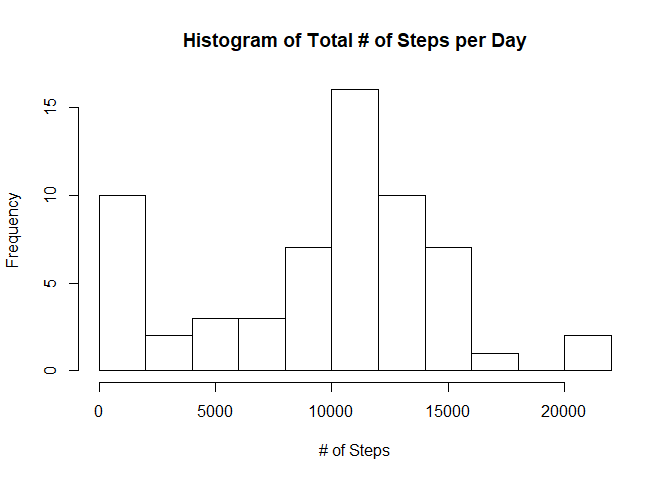
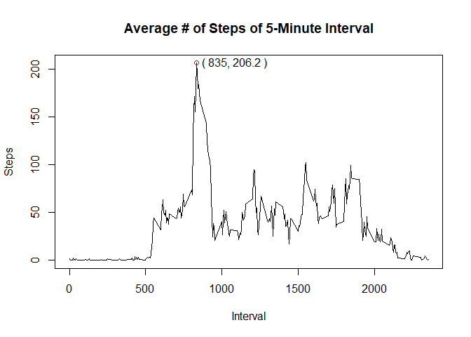
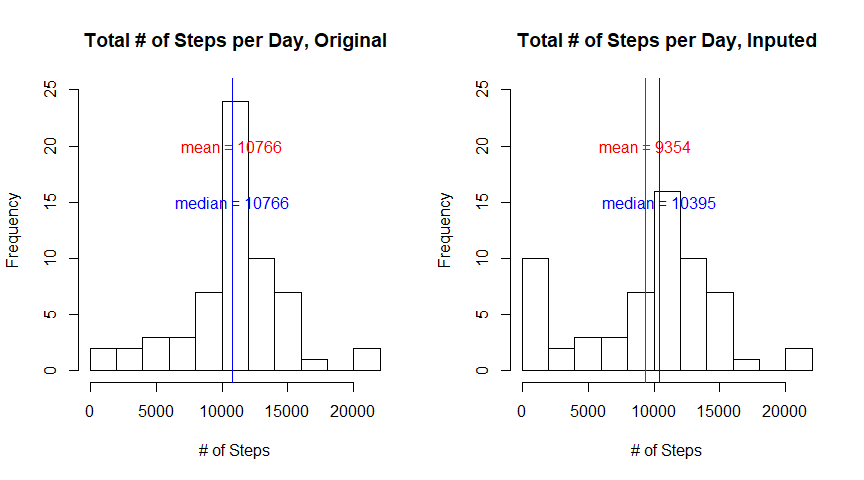
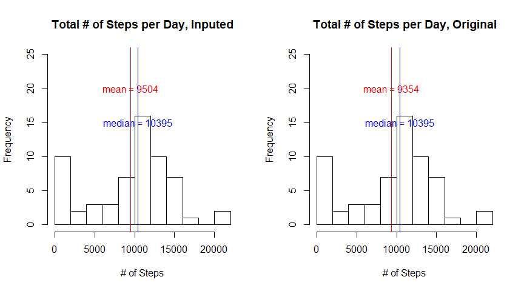
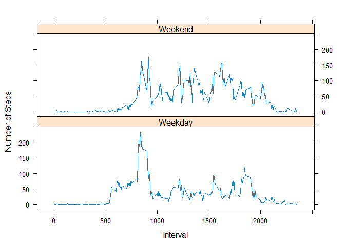

## Load data
First load the data 


```r
rm(list = ls())

library(dplyr)

if( !file.exists("data_project1.zip")) {
    download.file("https://d396qusza40orc.cloudfront.net/repdata%2Fdata%2Factivity.zip", "data_project1.zip")
}

if( !file.exists("activity.csv")) {
    unzip("data_project1.zip")
}

data_raw <- read.csv("activity.csv")
```

## 1 What is mean total number of steps taken per day?
1. Calculate the total number of steps taken per day
2. Make a histogram of the total number of steps taken each day
3. Calculate and report the mean and median of the total number of steps taken per day


```r
data_q1 <- data_raw %>% group_by(date) %>% summarise(total_step = sum(steps, na.rm = TRUE))
hist(data_q1$total_step, breaks = 10, main = "Histogram of Total # of Steps per Day", xlab = "# of Steps")
```

<!-- -->

## 2 What is the average daily activity pattern?
1. Make a time series plot (i.e. type = "l") of the 5-minute interval (x-axis) and the average number of steps taken, averaged across all days (y-axis)
2. Which 5-minute interval, on average across all the days in the dataset, contains the maximum number of steps?


```r
data_q2 <- data_raw %>% group_by(interval) %>% summarise(avg_step = mean(steps, na.rm = TRUE))


y_max <- max(data_q2$avg_step)
x_max <- data_q2$interval[which.max(data_q2$avg_step)]

plot(x = data_q2$interval, y = data_q2$avg_step, main = "Average # of Steps of 5-Minute Interval", 
     type = "l", xlab = "Interval", ylab = "Steps")
points(x_max, y_max, col = "red") 
text(x_max*1.3, y_max, labels = paste0("( ", x_max, ", ", format(y_max, digits = 4), " )" ))
```

<!-- -->

The interval 835 contains the max number of steps.

## 3 Imputing missing values
1. Calculate and report the total number of missing values in the dataset 
2. Devise a strategy for filling in all of the missing values in the dataset
3. Create a new dataset that is equal to the original dataset but with the missing data filled in.
4. Make a histogram of the total number of steps taken each day and Calculate and report the mean and median total number of steps taken per day. Do these values differ from the estimates from the first part of the assignment? What is the impact of imputing missing data on the estimates of the total daily number of steps?


```r
# compute and report # of NA
num_na_byCol <- sapply(data_raw, function(x){sum(is.na(x))})

index_na_byCol <- num_na_byCol > 0

if(any(index_na_byCol)) {
    for (i in 1 : sum(index_na_byCol)){
        cat("\n# of NA for the var '", names(data_raw)[i], "' is ", num_na_byCol[i], "\n", sep = "")
    }
}
```

```
## 
## # of NA for the var 'steps' is 2304
```

```r
# get index of rows for imputation
index_na_steps <- is.na(data_raw$steps)
```


#### 3.1 Imputation Stategy One: Mean

```r
## use mean of the interval (since the mean of the day is still NA for a few days)
data_mean <- data_raw %>% group_by(interval) %>% summarise(avg_step = mean(steps, na.rm = TRUE))

data_inpute_mean <- data_raw

data_inputed <- merge(data_inpute_mean[index_na_steps, ], data_mean)

data_inputed <- data_inputed %>% mutate(steps = avg_step) %>% select(names(data_raw))

data_inpute_mean[index_na_steps, ] <- data_inputed

data_q3 <- data_inpute_mean %>% 
           group_by(date) %>% 
           summarise(total_step = sum(steps))

par(mfrow = c(1, 2))
y_lim <- c(0, 25)

hist(data_q3$total_step, breaks = 10, main = "Total # of Steps per Day, Original", xlab = "# of Steps", ylim = y_lim)

mean_inpute <- mean(data_q3$total_step)
abline(v = mean_inpute, col = "red")
text(x = mean_inpute, y = 20, paste0("mean = ", format(mean_inpute, digits =2)), col = "red")
     
median_inpute <- median(data_q3$total_step)
abline(v = median_inpute, col = "blue")
text(x = median_inpute, y = 15, paste0("median = ", format(median_inpute, digits =2)), col = "blue")

hist(data_q1$total_step, breaks = 10, main = "Total # of Steps per Day, Inputed", xlab = "# of Steps", ylim = y_lim)

mean_orig <- mean(data_q1$total_step)
abline(v = mean_orig, col = "red")
text(x = mean_orig, y = 20, paste0("mean = ", format(mean_orig, digits =2)), col = "red")

median_orig <- median(data_q1$total_step)
abline(v = median_orig, col = "blue")
text(x = median_orig, y = 15, paste0("median = ", format(median_orig, digits =2)), col = "blue")
```

<!-- -->

When imputing using mean of each interval, the shape of distribution is similar to the original data set, but both mean and median go up compared with the original ones. Notice that the mean increases substantially, which is consistent with the "shoot up" of the tallest bar. 

### 3.2 Imputation Stategy Two: Median

```r
## use median of the interval (since the median of the day is still NA for a few days)
data_median <- data_raw %>% group_by(interval) %>% summarise(avg_step = median(steps, na.rm = TRUE))

data_inpute_median <- data_raw

data_inputed <- merge(data_inpute_median[index_na_steps, ], data_median)

data_inputed <- data_inputed %>% mutate(steps = avg_step) %>% select(names(data_raw))

data_inpute_median[index_na_steps, ] <- data_inputed

data_q3 <- data_inpute_median %>% 
    group_by(date) %>% 
    summarise(total_step = sum(steps))

par(mfrow = c(1, 2))
y_lim <- c(0, 25)

hist(data_q3$total_step, breaks = 10, main = "Total # of Steps per Day, Inputed", xlab = "# of Steps", ylim = y_lim)

mean_inpute <- mean(data_q3$total_step)
abline(v = mean_inpute, col = "red")
text(x = mean_inpute, y = 20, paste0("mean = ", format(mean_inpute, digits =2)), col = "red")

median_inpute <- median(data_q3$total_step)
abline(v = median_inpute, col = "blue")
text(x = median_inpute, y = 15, paste0("median = ", format(median_inpute, digits =2)), col = "blue")

hist(data_q1$total_step, breaks = 10, main = "Total # of Steps per Day, Original", xlab = "# of Steps", ylim = y_lim)

mean_orig <- mean(data_q1$total_step)
abline(v = mean_orig, col = "red")
text(x = mean_orig, y = 20, paste0("mean = ", format(mean_orig, digits =2)), col = "red")

median_orig <- median(data_q1$total_step)
abline(v = median_orig, col = "blue")
text(x = median_orig, y = 15, paste0("median = ", format(median_orig, digits =2)), col = "blue")
```

<!-- -->

When imputing using median of each interval, the shape of distribution is similar to the original data set, the median is constand and the mean goes up slightly. Since median is less affected by extreme values, it is better to use median for imputation.

## 4 Are there differences in activity patterns between weekdays and weekends?
1. Create a new factor variable in the dataset with two levels - "weekday" and "weekend" indicating whether a given date is a weekday or weekend day.
2. Make a panel plot containing a time series plot (i.e. type = "l") of the 5-minute interval (x-axis) and the average number of steps taken, averaged across all weekday days or weekend days (y-axis). 

```r
library(lattice)

data_q4 <- data_raw

data_q4$date <- as.Date(data_raw$date, "%Y-%m-%d")
data_q4$weekdays <- weekdays(data_q4$date)
data_q4$IsWeekend <- ifelse(data_q4$weekdays %in% c("Saturday", "Sunday"), "Weekend", "Weekday")

data_q4 <- data_q4 %>% group_by(IsWeekend, interval) %>% summarise(avg_step = mean(steps, na.rm = TRUE))

xyplot(avg_step ~ interval| IsWeekend, data = data_q4 ,type = "l",
       xlab = "Interval", ylab = "Number of Steps",
       layout=c(1,2))
```

<!-- -->
